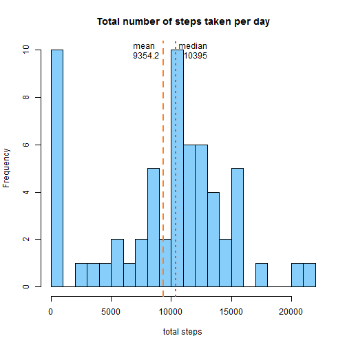
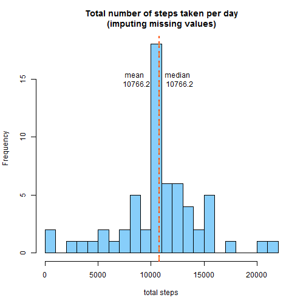
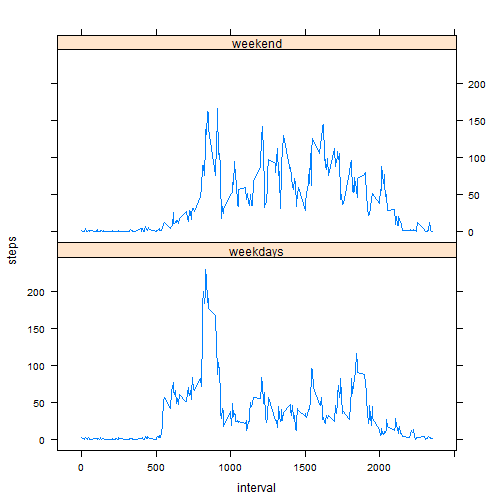

# **Loading and preprocessing the data**

```r
## Loading and preprocessing the data ##
setwd("C:\\Users\\Jihan Yu\\Desktop\\Coursera\\Data Sciences\\05 Reproducible research")
colClasses <- c("numeric", "Date", "numeric")
activity <- read.csv("./data/activity.csv", header=TRUE, 
             na.strings="NA", colClasses=colClasses)
```


# **What is mean total number of steps taken per day?**

```r
## Mean total number of steps taken per day ##
library(dplyr)   # Using dplyr package to group activity by date
activity_date <- group_by(activity, date)
# Find the total number of steps per day
tot_step_date <- summarise(activity_date, tot_steps=sum(steps, na.rm=TRUE))

hist(tot_step_date$tot_steps, breaks=20, col="lightskyblue", xlab="total steps",
     main="Total number of steps taken per day")

# Calculate mean and median & express on the histogram as vertical lines
result_steps <- c(mean=mean(tot_step_date$tot_steps, na.rm=TRUE),
    	  median=median(tot_step_date$tot_steps, na.rm=TRUE))
abline(v=result_steps["mean"], col="chocolate1", lty="dashed", lwd=2)
abline(v=result_steps["median"], col="orangered", lty="dotted", lwd=2)
text(result_steps[1]-1500, 10, 
     paste("mean", expression("\n"), round(result_steps["mean"], 1)))
text(result_steps[2]+1500, 10,
     paste("median", expression("\n"), round(result_steps["median"], 1)))
```

 

```r
print(result_steps)
```

```
##     mean   median 
##  9354.23 10395.00
```

- Mean : 9354.23  
- Median : 10395.00  


# **What is the average daily activity pattern?**

```r
## Average daily activity pattern ##
# Find the average numbers of steps across all days
activity_int <- group_by(activity, interval)
ave_step_int <- summarise(activity_int, ave_steps=mean(steps, na.rm=TRUE))

# Find 5-min interval name which contains the maximum number of steps
max_step <- ave_step_int$interval[which(ave_step_int$ave_steps==
    				max(ave_step_int$ave_steps))]

plot(ave_step_int$interval, ave_step_int$ave_steps, type="l",
     xlab="time interval", ylab="average number of steps",
     main="average daily activity pattern", lwd=2)
abline(v=max_step, col="red", lty=2, lwd=2)
text(max_step-100, 200, paste("max", expression("\n"), max_step))
```

 

```r
print(max_step)
```

```
## [1] 835
```

Max 5-min interval : 835 (AM 8:35~8:39)  


# **Imputing missing values**

```r
## Imputing missing values ##
# total number of missing values in the datasets
Num_missing <- apply(is.na(activity), 2, sum)
print(Num_missing)
```

```
##    steps     date interval 
##     2304        0        0
```

```r
# To fill the missing values, I use the average numbers of steps taken, averaged
#    across all days which were found previously (ave_step_int)
# (There are several days which has No steps for thos days)
act_imputNA <- activity;  id_NA <- vector()
for(i in ave_step_int$interval){
    id_NA <- which((act_imputNA$interval==i) & (is.na(act_imputNA$steps)))
	act_imputNA$steps[id_NA] <- ave_step_int$ave_steps[which(ave_step_int$interval==i)]
}
apply(is.na(act_imputNA), 2, sum)
```

```
##    steps     date interval 
##        0        0        0
```

Before imputing missing values, there are 2304 missing values in column "steps".  
After imputing, there are no missing values in the dataset.  


```r
imputNA_date <- group_by(act_imputNA, date)
imputNA_tot_date <- summarise(imputNA_date, tot_steps=sum(steps, na.rm=TRUE))

# Histogram of the total number of steps taken eacy day
hist(imputNA_tot_date$tot_steps, breaks=20, col="lightskyblue", xlab="total steps",
     main="Total number of steps taken per day\n(imputing missing values)")

# Calculate mean & medain total number of steps taken per day
#   and express them on the histogram
imputNA_result_steps <- c(mean=mean(imputNA_tot_date$tot_steps, na.rm=TRUE),
			  median=median(imputNA_tot_date$tot_steps, na.rm=TRUE))
abline(v=imputNA_result_steps["mean"], col="chocolate1", lty="dashed", lwd=2)
abline(v=imputNA_result_steps["median"], col="orangered", lty="dotted", lwd=2)
text(imputNA_result_steps[1]-2200, 15, 
     paste("mean", expression("\n"), round(imputNA_result_steps["mean"], 1)))
text(result_steps[2]+2200, 15,
     paste("median", expression("\n"), round(imputNA_result_steps["median"], 1)))
```

 

```r
print(imputNA_result_steps)
```

```
##     mean   median 
## 10766.19 10766.19
```

New mean & median values are different from the estimates using original dataset (which contains missing values, NAs)  
New mean & median values are larger than original values  
  and histogram using new dataset reveals higher kurtosis and more symmetric.  
New histogram has nearly normal distribution, so mean and median are identical.  
(Original distribution is positively skewed, so mean is smaller than median)  
By imputing missing values, the data become more normally distributed.  


# **Are there differences in activity patterns between weekdays and weekends?**

```r
## Differences in activity patterns between weekdays & weekends ##
# Convert the date to weekday names
week_abb <- weekdays(act_imputNA$date, abb=TRUE)
# Change the weekname abbreviation to English
#  (In this computer's setting, weeknames are expressed as Korean ("일", "월"...)
weekname <- c("Sun", "Mon", "Tue", "Wed", "Thu", "Fri", "Sat")
names(weekname) <- c("일", "월", "화", "수", "목", "금", "토")
week_abb <- weekname[week_abb]

# Transform the weekday abbreviation name to 2-level factors, "weekdays" or "weekend"
# (weekdays : Mon, Tue, Wed, Thu, Fri, Sat / weekend : Sun, Sat)
week_abb[week_abb %in% weekname[c(1, 7)]] <- "weekend"
week_abb[week_abb %in% weekname[2:6]] <- "weekdays"
week <- as.factor(week_abb)
act_imputNA <- cbind(act_imputNA, week)   # create new factor variable with 2 levels

# Divide the new dataset(imputing NAs) into 2 subsets 
#     as week-levels(weekend or weekdays)
act_imputNA_weekend <- subset(act_imputNA, subset=(week_abb=="weekend"))
act_imputNA_weekdays <- subset(act_imputNA, subset=(week_abb=="weekdays"))

# Find the average numbers of steps across all days in each dataset(weekend or weekdays)
#   then merge the results to one final dataset
imputNA_weekend_int <- group_by(act_imputNA_weekend, interval)
imputNA_weekend_ave <- summarise(imputNA_weekend_int, 
    			 ave_steps=mean(steps, na.rm=TRUE))
imputNA_weekend_ave$week <- c(rep("weekend", length(imputNA_weekend_ave$interval)))

imputNA_weekdays_int <- group_by(act_imputNA_weekdays, interval)
imputNA_weekdays_ave <- summarise(imputNA_weekdays_int, 
				 ave_steps=mean(steps, na.rm=TRUE))
imputNA_weekdays_ave$week <- c(rep("weekdays", length(imputNA_weekdays_ave$interval)))

act_imputNA_ave <- rbind(imputNA_weekend_ave, imputNA_weekdays_ave)

# Make a panel plot containing a time series plot using lattice package
library(lattice)
xyplot(ave_steps~interval|week, type="l", data=act_imputNA_ave, 
       ylab="steps", layout=c(1, 2))
```

 

In weekdays, peak activity reveals at AM 8~9:30 and 2nd peak is at about 7PM  
But in weekend, several peaks with similar height are throughout daytime  
This result means that /   
  in weekdays, most activities are seemed to be related to going to work or home /  
  but in weekend, many other kinds of activities are performed during daytime  
